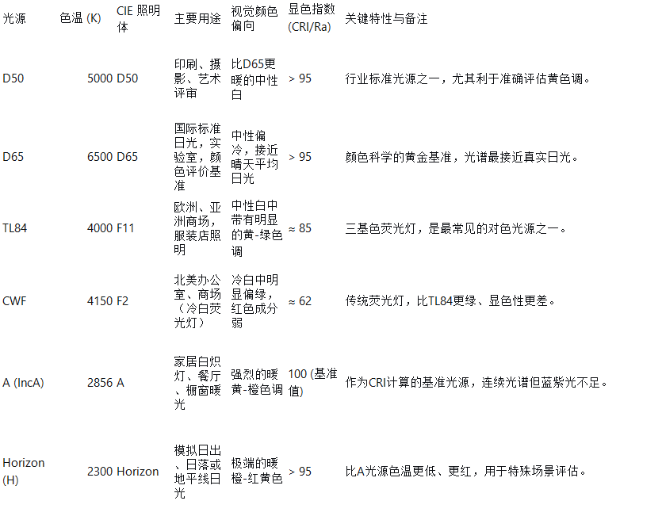
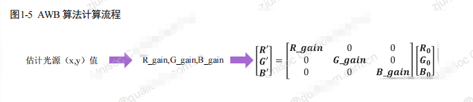
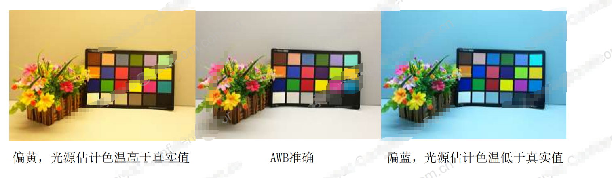
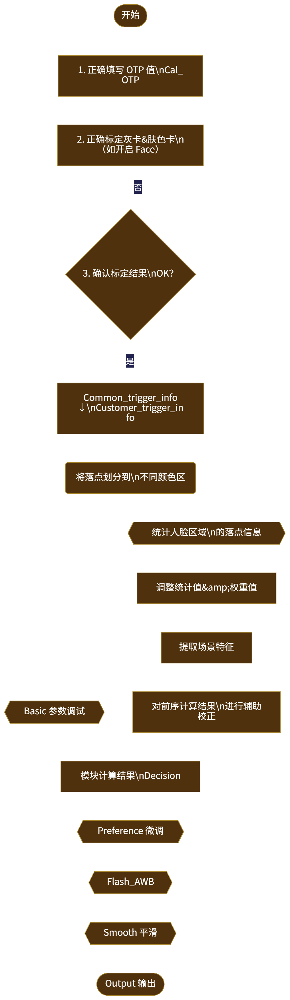

# AWB 
灯色区分：
色温（K）	光源类型	颜色倾向
2500-3000	白炽灯	    偏黄红
4000-5000	荧光灯/LED	偏绿
5500-6500	中午日光	中性
7000-9000	阴天/多云	偏蓝冷


## AWB 原理

```
0.颜色恒常性
原理：人眼在观察不同光源下的同一物体时，大脑会依据经验对图像进行处理，是的人眼视觉中，物体的颜色随光源的变化很微小。
camera中的白平衡模块正是在模拟人眼感知的颜色恒常性，先估计出当前光源的颜色，再通过计算使得图像中的各物体颜色正确如下图
AWB调试的目的：经过正确的标定，以及调参，使得AWB算法能正确地估计出测试场景的光源信息。
```




```
1.灰色世界理论
原理： 假设一幅图像中所有物体颜色在统计意义上应呈“中性灰”，即平均 R = G = B。如果偏离此条件，说明图像受到了光源色偏影响。
实现步骤：

从原始 RAW/Bayer 图像中获取全帧或分块区域的 RGB 通道均值；

计算增益修正因子：


优点：

实现简单，适合硬件实时处理；
对色温偏移中等场景响应较快；
可用于动态帧间漂移修正（帧间稳定性高）。
缺点：

容易被色调偏移场景干扰（如大面积草地、蓝天）；
在高饱和光源（如霓虹灯、暖黄LED）下估算失真；
无法判断局部“主导光源”，不适合多光源环境。

2.Perfect Reflector（理想反射模型）
原理： 假设图像中存在一个反射率为 100% 的“白色物体”（如纸张、瓷砖、人眼白），该物体理论应呈现 RGB 通道中值最大，因此可以反推出光源色温。

实现步骤：

对图像做亮度排序（如基于亮度值 L = max(R, G, B)）；
从最亮的 top N% 像素中选取统计区域；
计算其 RGB 平均值，作为白点估计；
生成通道增益调整值，实现白平衡。
优点：

色彩校正更为准确，尤其在画面中有白色参考时（人脸、眼白）；
响应灵敏，适合突变场景（如切换房间）；
对偏色光源适应性更强。
缺点：

高亮区域误识别风险大（如 LED 光斑、反光镜）；
容易受饱和像素或压缩损失影响；
在夜景、逆光等暗环境下估算偏移显著。

3.Chromaticity-based 分布估计法
核心思想： 将 RGB 数据映射到色度空间（如 rg chromaticity），构建标准白点的分布模型，并通过概率距离判断当前光源色温。

实现流程：

将图像转换为 chromaticity 空间：


在 (r, g) 平面上建立光源色温散点分布；

对当前帧求 (r,g) 平均，计算其到标准白点（如 D65）的色差；

使用近邻权重或最小距离作为光源分类依据；

反推出校正增益或色温估算值。

优点：

相对光照不变性强；
与真实照度变化相关性好；
易集成 AI 模型特征输入。
```

## AWB Gain 控制机制与 RGB 通道响应曲线

在自动白平衡算法确定目标白点后，核心任务即为控制 RGB 通道的 增益（Gain），以实现色彩校正。增益控制不仅是对 RGB 通道简单线性放大，更涉及到 Sensor 的响应特性、ISP 的位深约束以及图像质量调节能力边界。

```
1.在 ISP 中，AWB 输出的 R 和 B 增益（G 通道通常为 1.0）直接作用于 Bayer 域原始数据。其核心公式如下：

G 通道为基准，维持画面亮度基线；
Gain 通常以浮点值表达，如 R_gain = 1.7，表示将红通道像素强度放大 70%。

2.不同 Sensor 在不同波段的响应灵敏度存在差异，且曲线非完全线性，这会直接影响 AWB 调节精度。

高端 CMOS Sensor（如 IMX989、OV50H）提供出厂测定的 R/G/B 光谱响应；
中低端 Sensor 未做独立通道线性补偿时，增益幅度会造成画面偏色、色阶断裂或高光溢出。
实战建议：

实施通道非线性 LUT 映射（如对 R 通道高光做 Soft-Clip）；
增益最大值应受制于 Sensor 位深动态范围，如 10bit Sensor 中最大有效 Gain 不宜超 2.5；
在色温较高（>7000K）下红通道响应弱，R_Gain 容易拉高引发噪点增强，需配合 NR 约束。

```
下图是展锐关于awb的流程示意图
<!--  -->


## AWB 展锐注意事项
核心思想,让落点落在他应该在的区域内,再进行调试.如果是红色的物体,但落点落在了灰区,想要强行凹成红色将会付出很大的代价
```
首先调试basic 模块再调试preference 模块之后依据情况调整face模块
其中basic boundary 模块通过调整各个颜色的划分范围以及过渡区的大小来改变落点的颜色，之后通过weight模块来调整不同场景地下awb的计算权重。
一般情况下高亮下灰区要小一些，在低亮下灰区要大一些，
标准光源下的灰卡统计点应该落入灰区中，灰区越大，算法所能支持的光源种类越多，但精度灰有所降低
过渡区边界和其颜色区域边界一定要保持些许距离，有利于awb过渡的更加平滑。
各个颜色区之间尽量不要有空洞的地方避免特殊场景落入奇异区域，从而无法使用cikirmethod参数进行偏移得到正确的光源
针对weight模块,一般在bv搞的地方使用更高的权重,在低bv地方使用较低的权重,原因是因为低亮处的有效信息更少,避免错误的信息导致出现更多的异常
```

当出现AWB跳变时,首先确定颜色过渡是否合理,不应该出现有剧烈的颜色变化.其次确定权重设置是否合理.
当出现AWB震荡时,调整tolerance的值,越大越不容易出现震荡,但会增加收敛的误差.或者调整收敛速度speed的值越打,收敛速度越快,但更容易出现震荡