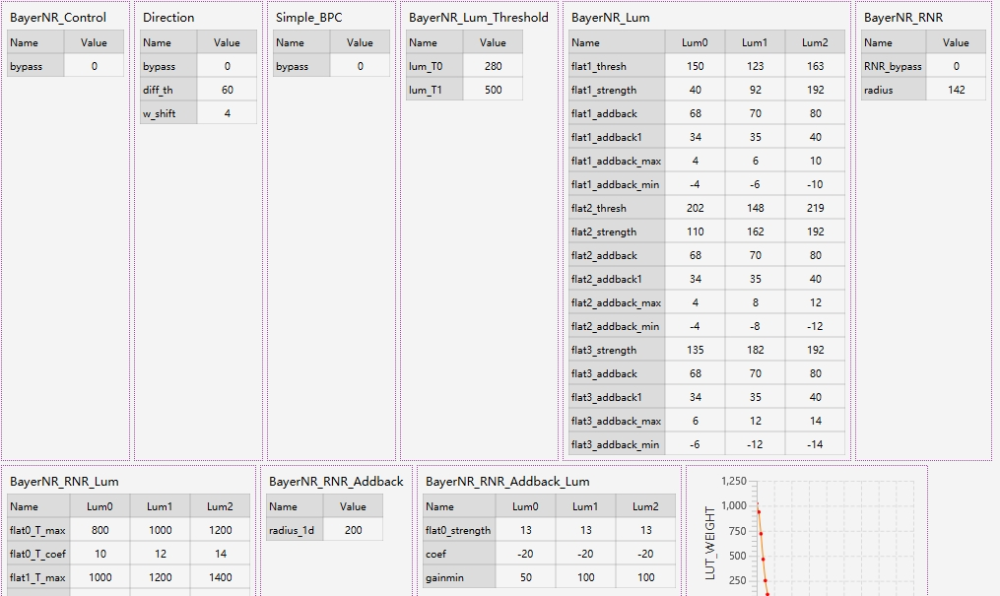

# bayer_nr
```
Bayer NR 模块通过 3 个亮度区域和 4 个频率区域划分，将图像的每个像素点分类到 12 个区域里面。待调
优图像像素点划分到合理的区域后，再使用合理的降噪强度参数，以达到较好的降噪效果。在调试的过
程中，会借助查看 MAP 图，获取 MAP 图信息来合理地修改对应的参数
```
## 如何标定
灯箱只有公司有，等什么时候有项目的时候再偷偷拍几张
```
1.在D65光源下，设置光源亮度为最大亮度
将24色卡放置灯箱中进行拍摄，调整灰卡距离，确保灰色部分位于下方，同时将色卡居中
```
<font color="red">VST作用：</font>得到VST和IVST两张表用做噪声变换
```
2.VST的sensor Raw图
使用手动曝光的方式设置曝光时间以及增益，增益设置为128/192/256/320
保持色卡19色块bv处于190-220之间，拍摄色卡保存senser Raw图
将图片放到对应的地方工具便可以自动计算了
```
<font color="red">SAD作用：</font>计算不同亮度段小爱的频率阈值

```
3.SAD的Dcam RAW图
使用手动曝光的方式设置曝光时间以及增益，增益设置为128/256/512/1024/2048/4096/8192
保持色卡19色块bv处于190-220之间，拍摄色卡保存Dcam Raw图
将图片放到对应的地方，框选24色卡工具便可以自动计算了
```

<font color="red">标定RNR作用：</font>更具LSC table表得到沿径向去噪的保护半径，速率，截止值以及回加噪声的保护半径

```
4.RNR标定
RNR的标定需要调用Alsc标定时DNP灯光下的ALSC table表，在此之前请先完成ALSC标定。
选择DNP光源对应的文件[00]。
此时Gain档位1x,2x,4x,8x,16x,32x,64x下的部分数据会更新其中radius和radius_ld和标定得出radius和radius_ld保持一致

```


## 如何调试
```
1.根据图像的gain值选着对应的region的参数列表，后开启bayer_nr模块
```

```
2.调节亮度区域划分参数，确保合理的分配三个亮度区。具体亮度情况可以通过lum_flag_maop图查看划分是否合理
```
```
3.调试频率划分参数，将所有的像素划分到不同的频率区域，以适配不同的降噪强度。具体频率划分可以通过flag_maop图查看划分是否合理
```

```
4.调节降噪强度
5.开启沿径向降噪模块，首先确定保护半径是否合理，再更具四角噪声的情况调节降噪递增变化的强度
```
```
6.最后根据噪声情况，确定图像纹理是否有被抹去态度，可以通过调节回加噪声，来增加细节。但需要注意的是噪声同时也会增加
```
```
7.根据图像边沿噪声情况，调节边沿线的对比度
```
