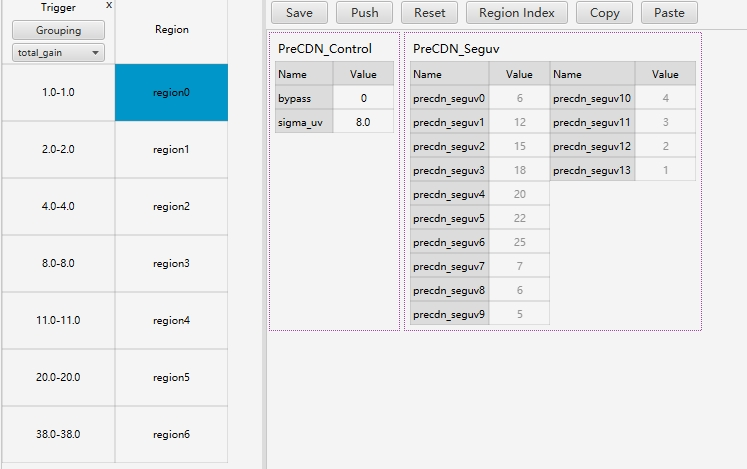

# CDN模块
<font color="red">PRECDN作用：</font>CDN模块是进行去彩照的模块主要分为三部分“PRECDN,CDN,POSTCDN”三个模块，三个模块相互独立不会相互影响

本实例安照PRECDN作为介绍


## 如何调试
```
1.根据pipeline的顺序，依次调节PRECDN,CDN,POSTCDN三个模块
2.只需要调整SIGMA_UV的数值就可以实现彩噪的处理，数值越大降彩噪的效果越明显。（postcdn_sigma_uv,UV通道的滤波权重表。在修改SIGMA_UV的时候，会自动生成）
3.面对彩噪的去噪强度的把握不宜过大，过大会导致原有的色也会一同丢失
对于暗处的彩噪可以也可以同时调整ccm降低一点色彩的饱和度
```