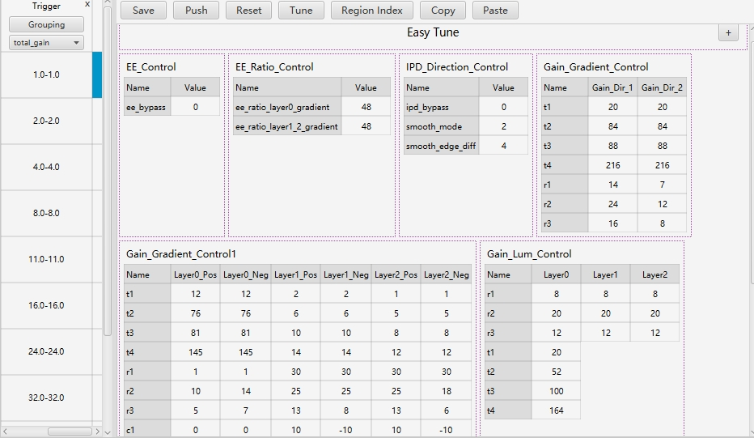
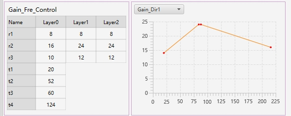

# EE模块
<font color="red">EE作用：</font>
```
EE模块的作用是增强图像的轮廓与细节，边缘增强必须要与降噪模块进行配合调试，因为增强轮廓和细节的同时必然会导致噪声的增加，而增强去噪的功能又必然导致细节的丢失，所有我们需要找到一个平衡点，不仅确保图像的轮廓与细节同时降低噪声。
```



## 如何调试

```
1.针对图像的宽边进行调整，通过调整ratio来调整宽边的程度。如果没有变化，需要检查Layer1/2_pos/neg的[c2,c3]是否太小
，在此基础之上宽边依旧还是很宽适当微调Gain_Dir_2的[r1,r3]
```

```
2.针对图像的细节进行调整，调整Layer1/2_pos/neg的[r1]，需要注意的是调整的数值不能被c1限制。洗的增加会导致平坦区域出现更多的噪声，需要平衡好画面的噪声以及细节
```

```
3.针对图像的黑白边程度进行调整，调节layer()的pos，neg的[r1,r2]整体的控制黑白边显示的程度，如果ratio增大的很多黑白边依然没有什么变化，需要考虑c1是否过小限制黑白边的显示程度
```

```
4.如果对增强的效果依旧感觉太弱或者太强可以通过调节Gain_lum/fre来调整不同亮度/频率下增强的力度
```