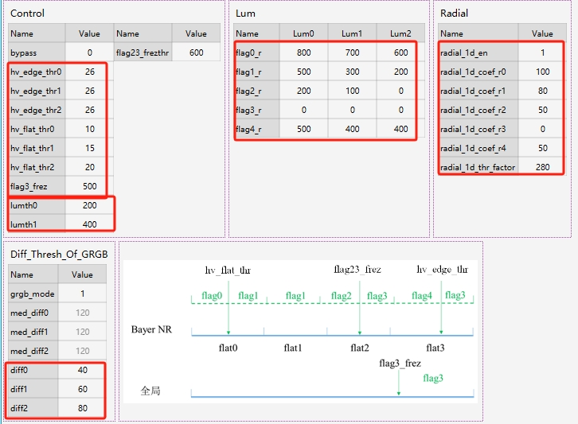
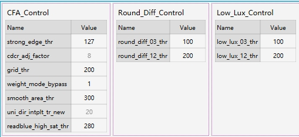
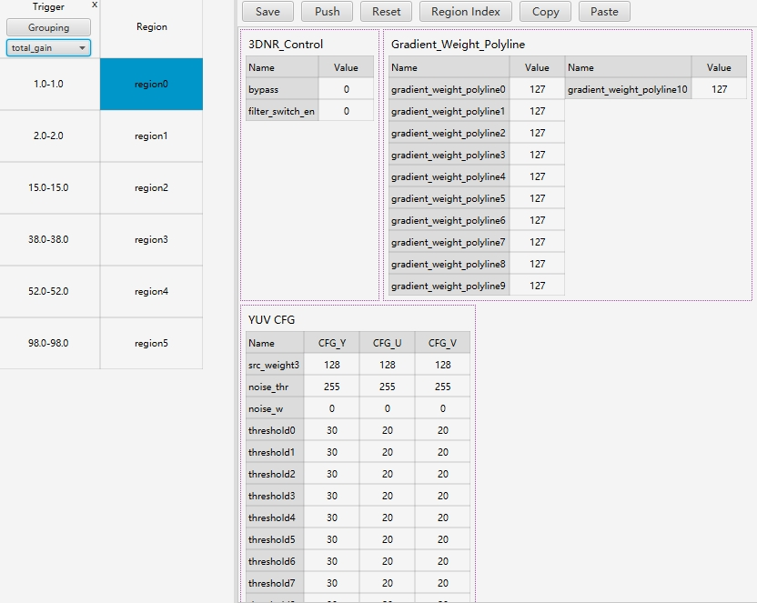

# IMBALANCE模块
主要针对网格噪声
通过3个亮度区域和5个频率区域划分，将图像的每个像素点分类到15个区域里面。待调优图像像素点划分到合理的区域后，再使用合理的参数，以达到更好的效果。在调试的过程中，会借助查看MAP图，获取MAP图信息来合理地修改对应的参数

## 如何调试
或许如果有需要在针对每个参数进行讲解

```
1.调整亮度以及频率区域划分是否合理
2.调整矫正阈值，diff[0,2]数值越大Gr和Gb通道的差异阈值越大，越多的区域被矫正。
3.需要较正的区域，更具亮度，频率划分，设定不同的矫正强度，建议逐步增强
4.如果图像四角的噪声明显多余中心区域，建议开启沿径向降噪模块（radius_id_cn=1），调试沿径向降噪，需要保证保护半径大小和李
```


# CFA模块

CFA模块仅在室外高亮环境调试，一般情况下建议使用默认参数。不建议过多调试


# 3DNR模块
3DNR是一种多帧如何降噪模块其中最大的特点是通过多次对两帧图像进行融合得到最终的降噪效果。对出现的噪点，噪声以及彩噪均有效果


## 如何调试

```
1.确定是否使用滤波器进行去噪，建议在亮环境下关闭滤波器去噪
2.调节平坦区融合权重，gradient_weight_polyline[0,3]j建议弱一点，在通过noise_thr和noise_w去除部分低频。该部分会带来鬼影不宜过强。
3.调节高频区融合权重，gradient_weight_polyline[4,10]j保持递减走势，根据亮度来进行调试
4.帧间权重调试，作用与全图，不建议设置过大，当出现鬼影的时候需要适当减弱平坦区和高频区的权重。
```